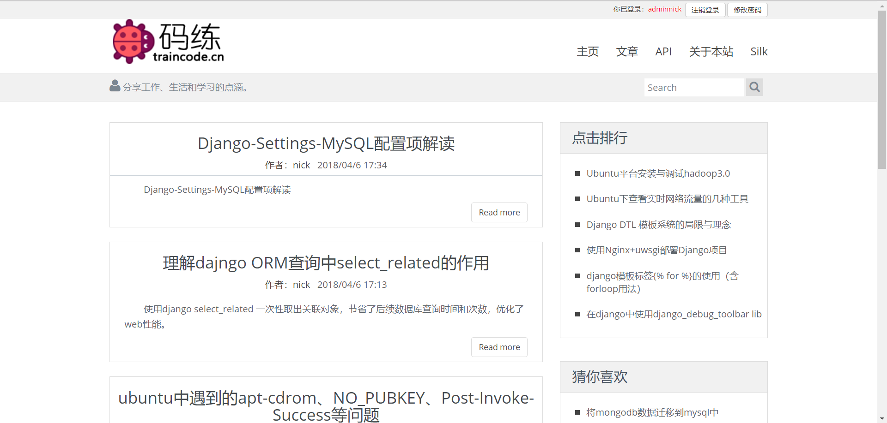
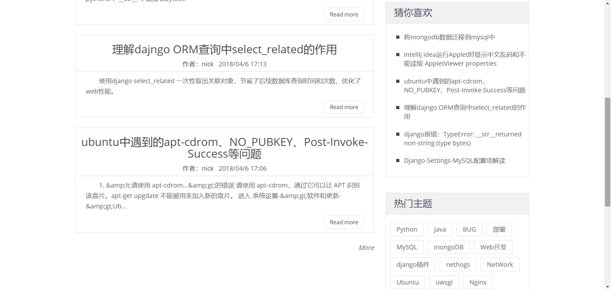
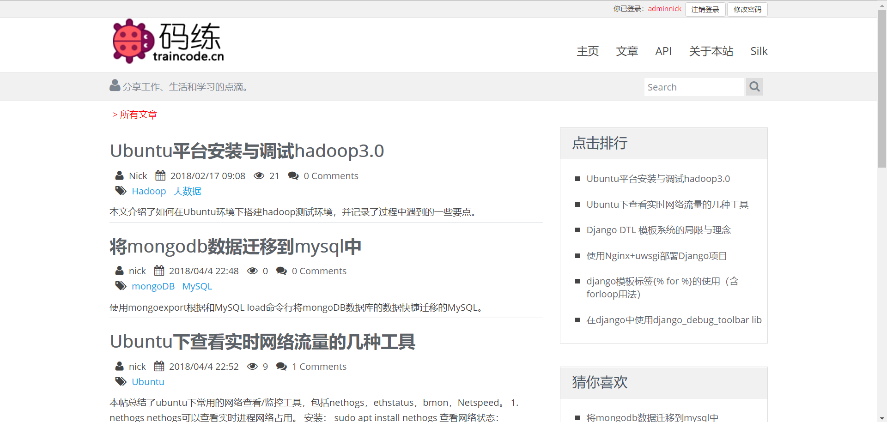
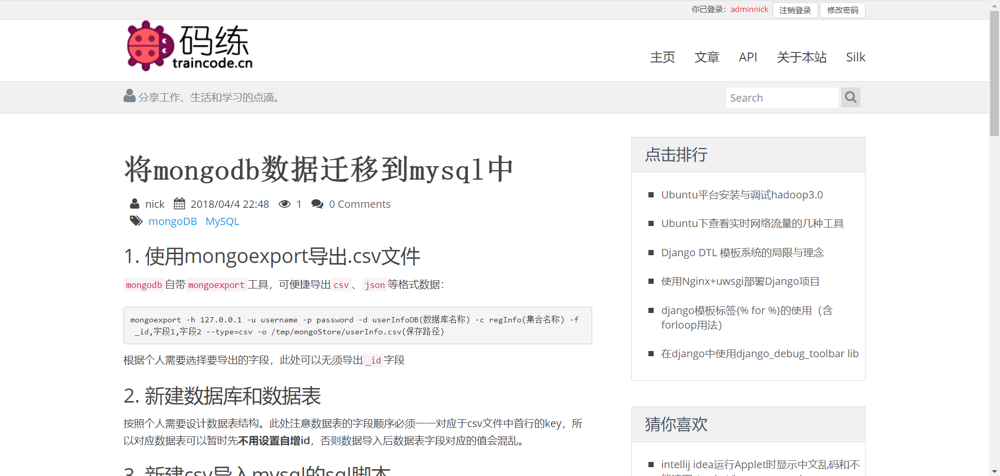
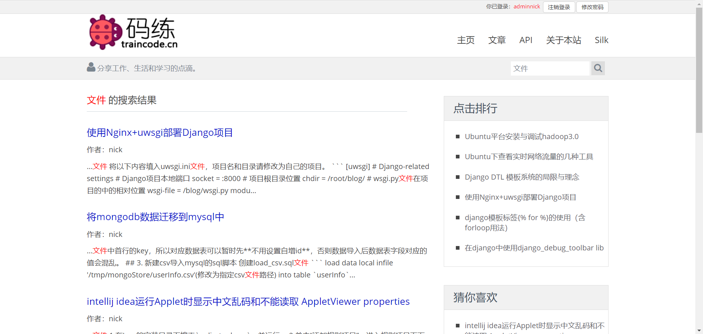
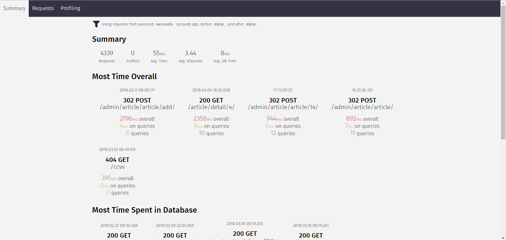

# NickBlog
A personal blog developed using django.  
Click to visit my blog: [码练-博客](http://www.traincode.cn)

## 1. Project Overview

具备博客的基本功能：
1. 发布文章（支持markdown语法）
2. 评论系统
3. 全文检索
4. 用户系统
5. 通过silk远程访问debug日志
6. 开发模式使用django_debug_toolbar

## 2. Web Page

### 2.1 Index page

= = = = =

### 2.2 Article list page

### 2.3 Article detail page

### 2.4 Article search function

### 2.5 Site request information debug tool  

